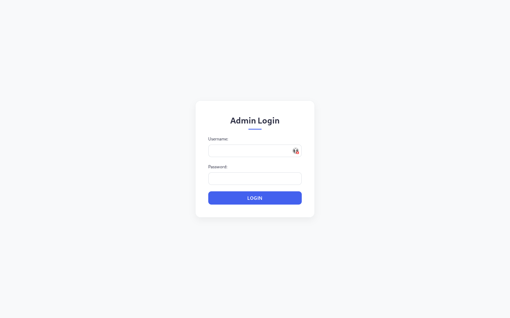
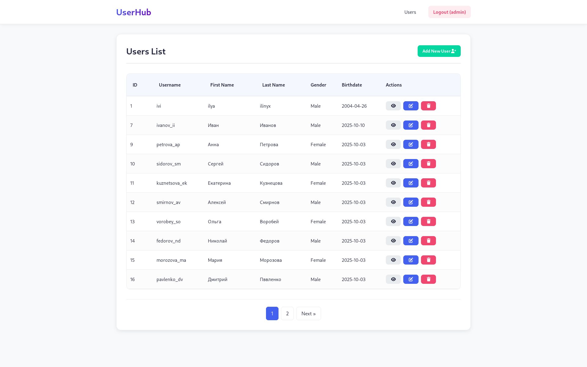
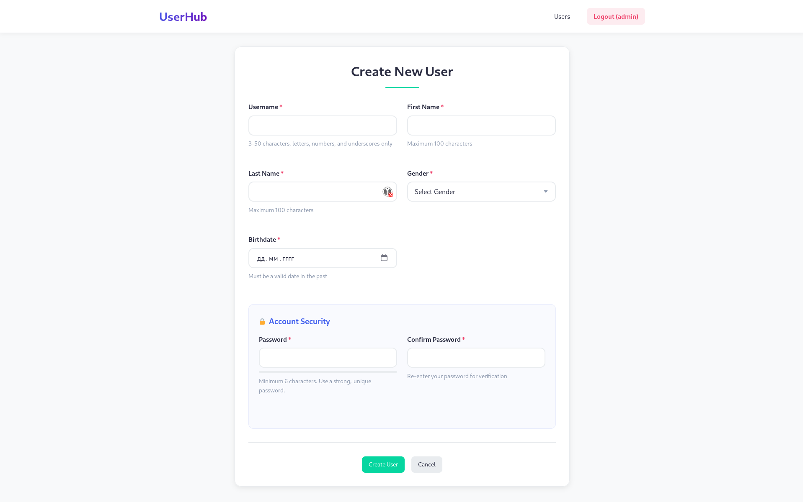
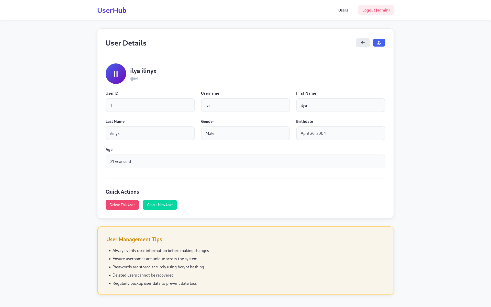
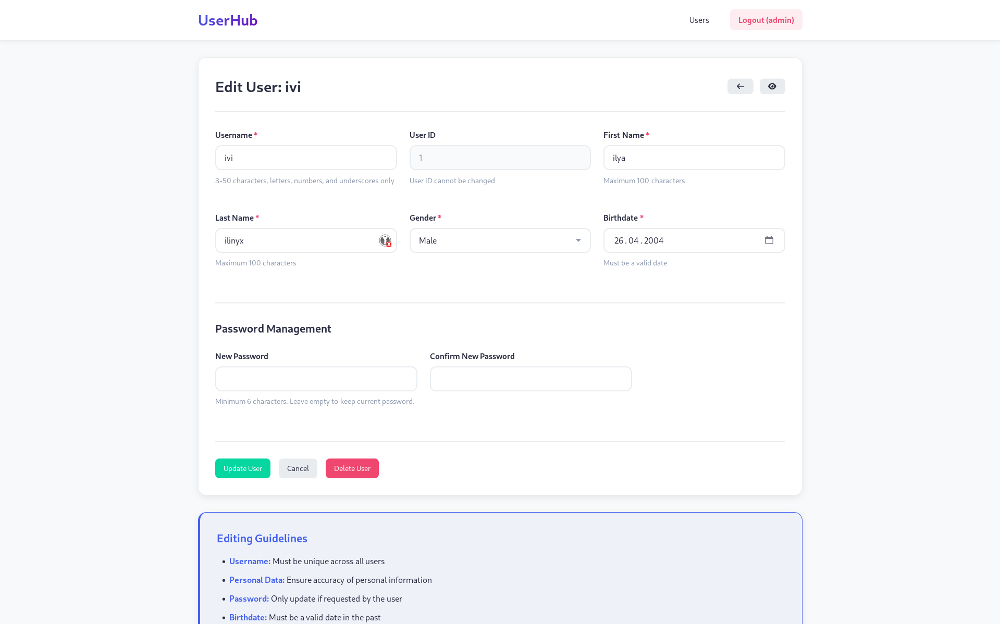

<p align="center"></p><a id='links'></a>

# <p align="center">UserHub</p>

### <p align="center">Web interface for the administration of records in the database</p>

### <p align="center">[Russian](README.md)</p>

##  Links
### [Technologies](#technologies) | [Description](#description) | [Routes](#routes) | [Init](#init) | [Interaction](#interaction) | [Gallery](#gallery)

##  Technologies <a id='technologies'></a>[](#links)

[PHP 8.4](https://www.php.net/) - Programming language.

[Mysql 8.0](https://www.mysql.com/) - Database.

[Docker](https://www.docker.com/) - Containerization.

HTML/CSS/JS - Frontend.


##  Description <a id='description'></a>[](#links)

The project is a pure PHP web service.
> [!WARNING]
> This service is written entirely from scratch, including MVC and routing.

### Basic entities

- **Users** (DB: users)
- **Admins** (DB: admins)

### Database dump:
- [dump.sql](src/database/dump.sql)

### Technical features
- **MVC**
- **Template Engine**
- **Pagination** from users
- **Sorting** from users
- **type hints**
- **Validation** via Requests
- **Business logic is represented in Services**
- **DTO** for data exchange between layers

##  Routes <a id='routes'></a>[](#links)

#### Auth
| Method | Endpoint | Description     |
|-------|----------|-----------------|
| POST  | `/login` | Login for admin |
| GET  | `/login` | Page for login  |

#### Secure routes (authentication required)

| Method | Endpoint              | Description    |
|-------|-----------------------|----------------|
| GET   | `/users`              | get all users  |
| GET   | `/users/create`       | create user    |
| GET   | `/users/{id}`         | get user       |
| GET   | `/users//{id}/edit`   | Edit user      |
| GET   | `/logout`             | Exit for admin |
| GET   | `/users/{id}/delete`  | Delete user   |
| POST  | `/users/{id} `        | Update user    |
| POST   | `/users/create`      | Create user    |

##  Init <a id='init'></a>[](#links)
> [!NOTE]
> It is recommended to use DNS 8.8.8.8 to avoid problems with containers.
### Setting up the environment
```bash
cp .env.example .env
```
### Start Docker
```bash
docker compose up -d --build
```
### After successful launch, the service will be available at:
### `http://localhost`

##  Interaction <a id='interaction'></a>[](#links)
### Administrator login details:
```
username: admin, 
password: password
```
### Sorting:
```
?page=1&sort_by=id&sort_order=ASC
?page=1&sort_by=id&sort_order=DESC
```
### Fields for sorting:
```
id, username, first_name, last_name
```

##  <a id='gallery'></a> Gallery [](#links)






